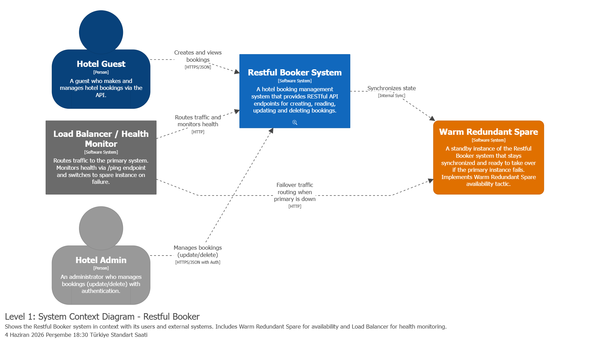
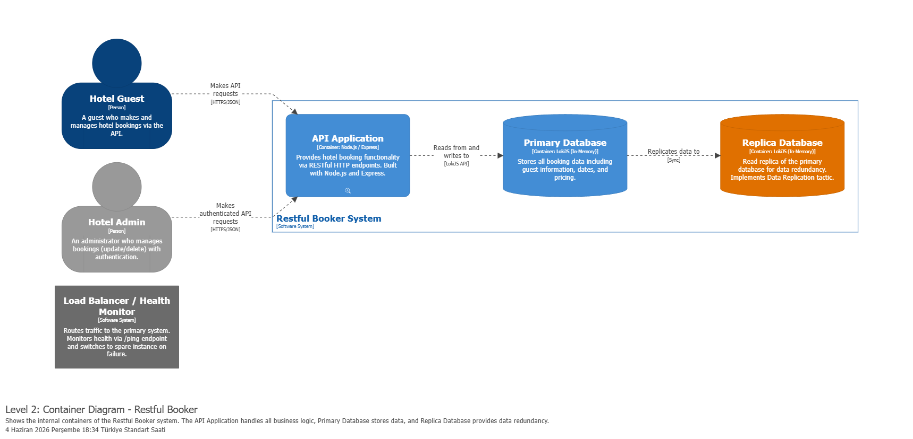
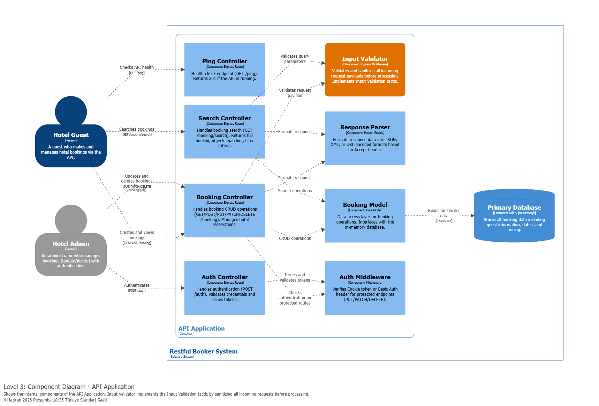

# JOGGERS - Restful Booker

SE322 Software Architecture Course Project - Spring 2025-2026

Based on [restful-booker](https://github.com/mwinteringham/restful-booker) by Mark Winteringham.

---

## Group Members

| Name | Student ID | GitHub Username |
|------|-----------|-----------------|
| Hasan Arda Celik | 22244710061 | celikhasanarda |
| Ozgur Kilic | 22244710051 | klcozgur |
| Ertugrul Celik | 23244710081 | ertugrulcelikgpt |

---

## New Endpoint - GET /booking/search

A new search endpoint was added that returns **full booking objects** matching the given filter criteria.

**URL:** `GET /booking/search`

**Query Parameters:**

| Parameter | Required | Description |
|-----------|----------|-------------|
| `firstname` | Optional | Filter by guest first name |
| `lastname` | Optional | Filter by guest last name |
| `checkin` | Optional | Filter bookings with check-in on or after this date (YYYY-MM-DD) |
| `checkout` | Optional | Filter bookings with check-out on or before this date (YYYY-MM-DD) |

**Example Request:**
```
GET /booking/search?firstname=Jim&lastname=Brown
```

**Example Response:**
```json
[
  {
    "bookingid": 1,
    "firstname": "Jim",
    "lastname": "Brown",
    "totalprice": 111,
    "depositpaid": true,
    "bookingdates": {
      "checkin": "2018-01-01",
      "checkout": "2019-01-01"
    },
    "additionalneeds": "Breakfast"
  }
]
```

Unlike the existing `GET /booking` endpoint (which only returns booking IDs), this endpoint returns the complete booking objects. All parameters can be combined for more specific searches.

**Implementation Details:**
- Route handler added in `routes/index.js`
- New `search()` function added to `models/booking.js`
- Uses LokiJS `$gte` and `$lte` operators for date filtering

---

## OpenAPI Specification

The full API documentation is available in OpenAPI 3.1 format:

[docs/api/openapi.yaml](docs/api/openapi.yaml)

This specification covers all endpoints including the new `GET /booking/search` endpoint, all request/response schemas, and authentication methods (Cookie token and Basic Auth).

---

## C4 Architecture

The system architecture is modeled using the C4 model with Structurizr. The DSL source file and exported diagrams are located in [`docs/architecture/`](docs/architecture/).

### Level 1 - System Context

Shows the Restful Booker system in its environment with users (Hotel Guest, Hotel Admin), the Load Balancer/Health Monitor, and the Warm Redundant Spare instance.



### Level 2 - Container

Shows the internal containers of the Restful Booker system: the API Application (Node.js/Express), the Primary Database (LokiJS), and the Replica Database for data redundancy. The Load Balancer is shown as an external system routing traffic.



### Level 3 - Component

Shows the internal components of the API Application: Ping Controller, Auth Controller, Booking Controller, Search Controller, Input Validator, Response Parser, Booking Model, and Auth Middleware. The Input Validator component is highlighted as it implements the Input Validation security tactic.



---

## Architectural Tactics

Three architectural tactics are incorporated into the system design and made visible in the C4 diagrams.

### Warm Redundant Spare

- **Category:** Availability
- **Visible in:** Level 1 (System Context Diagram)
- **Description:** A standby instance of the Restful Booker system ("Warm Redundant Spare", shown in orange) stays synchronized with the primary system. The Load Balancer / Health Monitor continuously checks the primary system's health via the `GET /ping` endpoint. If the primary instance fails to respond, the Load Balancer automatically routes all incoming traffic to the warm spare instance, minimizing downtime and ensuring service continuity.

### Input Validation

- **Category:** Security
- **Visible in:** Level 3 (Component Diagram)
- **Description:** All incoming API requests pass through the "Input Validator" component (shown in orange) before being processed by any controller. This validation layer sanitizes and validates request payloads using the `validate.js` library, preventing malformed data, injection attacks, and ensuring data integrity. Both the Booking Controller and Search Controller route their incoming data through this component before performing any business logic.

### Maintain Multiple Copies of Data (Data Replication)

- **Category:** Performance / Reliability
- **Visible in:** Level 2 (Container Diagram)
- **Description:** The primary LokiJS database replicates all booking data to a "Replica Database" node (shown in orange). This ensures data redundancy - if the primary database node experiences a failure, the replica contains a synchronized copy of all booking records, preventing data loss and allowing read operations to continue from the replica.
